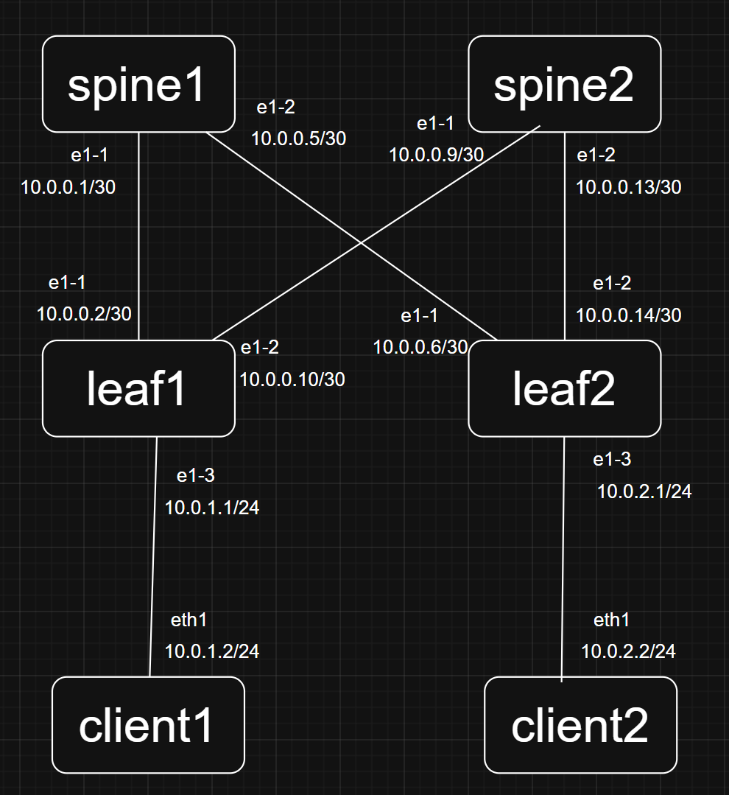

# Network Automation Project

## Overview
Ansible을 이용해서 Arista EOS 장비에 자동으로 설정을 밀어넣는다.

pyeapi을 이용해서 현재 장비 설정 상태를 report.json으로 추출해서 확인할 수 있다.

## Tech Stack
* Ansible
* Containerlab
* Arista cEOS
* pyeapi

## Topology


## Featuers
* enable API
* config IP Address
* config Loopback
* config OSPF
* parsing data

## How to Run

Run containerlab
```
containerlab deploy -t containerlab/topo.yml
```

Run Ansible
```
ansible-playbook -i ansible/inventory/hosts.yml ansible/playbook/control.yml
```

Run Parsing
```
python3 pyeapi/parsing.py
```

## Example Output
report.json
```
{
    "hostname": "spine1",
    "interfaces": [
        {
            "name": "Ethernet1",
            "status": "connected",
            "protocol": "up",
            "ip": "10.0.0.1",
            "prifix": 30,
            "network": "10.0.0.1/30"
        },
        {
            "name": "Ethernet2",
            "status": "connected",
            "protocol": "up",
            "ip": "10.0.0.5",
            "prifix": 30,
            "network": "10.0.0.5/30"
        },
        {
            "name": "Loopback0",
            "status": "connected",
            "protocol": "up",
            "ip": "1.1.1.1",
            "prifix": 32,
            "network": "1.1.1.1/32"
        },
        {
            "name": "Management0",
            "status": "connected",
            "protocol": "up",
            "ip": "172.20.20.10",
            "prifix": 24,
            "network": "172.20.20.10/24"
        }
    ],
    "ospf": [
        {
            "process_id": "1",
            "adjacency": "full",
            "area": "0.0.0.0",
            "interface": "Ethernet1",
            "neighbor_ip": "10.0.0.2"
        },
        {
            "process_id": "1",
            "adjacency": "full",
            "area": "0.0.0.0",
            "interface": "Ethernet2",
            "neighbor_ip": "10.0.0.6"
        }
    ]
},
```